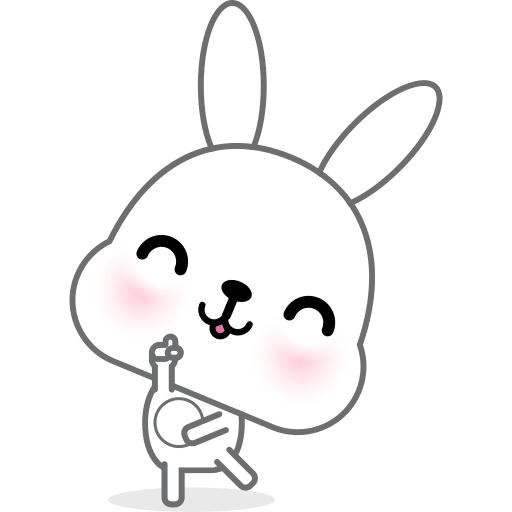
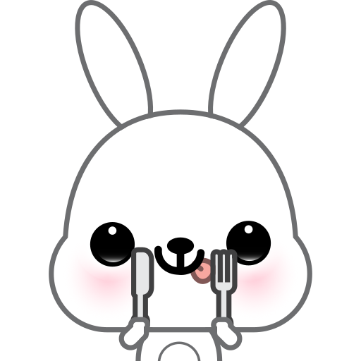

# MoodFlow
- I have tried making this website many times and outcomes always are different for some reason.
- MoodFlow is a website made to stay organised or track your mental status daily for about a month.
- I created this website because i myself sometimes like to track everything i do in life.
- Also the theme for this whole website was my own rabbit Cuddly (nickname-Chiku)
# Features
- The background is soft pink with rabbits.
- Background is also soft pick incase the background does not work.
- A mood calender with dates and working mood tracker.
- Note website where one can note their daily life and stuff and save it.
- All the dates on note.html are in circle
- A learn more page telling how to use website for users
- All the website have footer with cute rabbit pngs.
- Overall the theme of website is rabbit,soft-pink.
# How to Use
- On index.html click on the date u want to track the mood on (it gets saved automatically)
- The no. of days the mood was tracked is shown in the top right of the container.
- Note page has one of the form tag whose input type is text. Record your notes or watever u want and click on save.
# The Languages used 
The languages used are:
-Html(basic)
-CSS(styling)
-Java(for working of the site)

    
    
    
    
    
    
    
    

  

